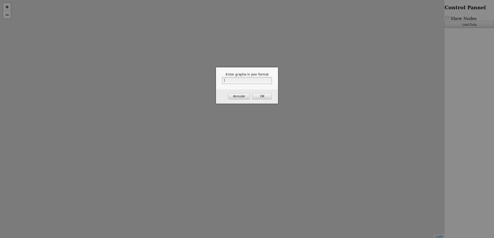
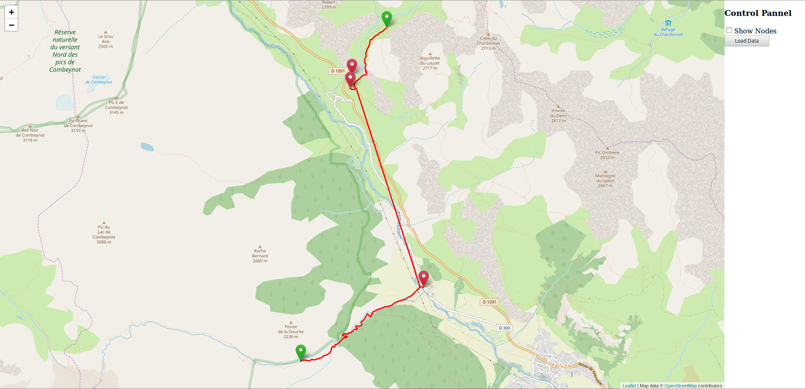
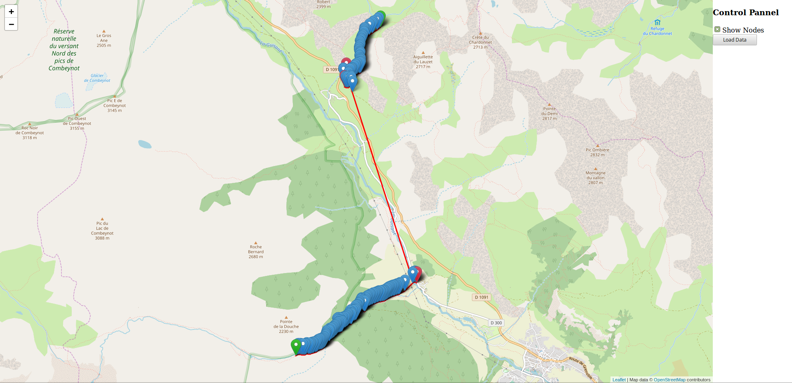
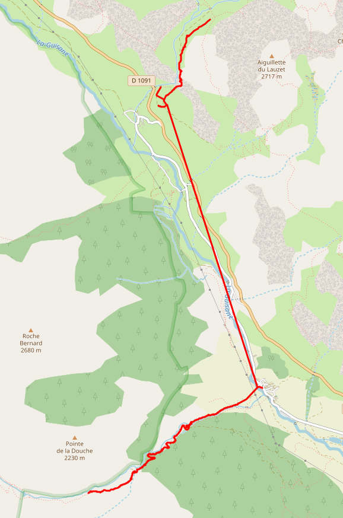
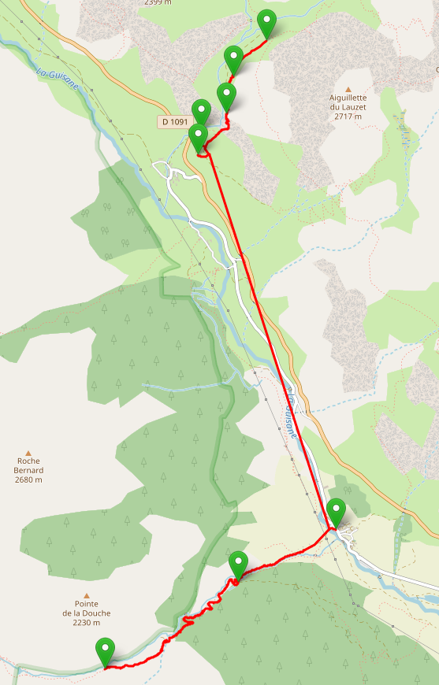
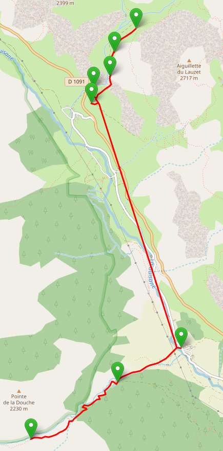

# OPV Graphe

<html>
      <strong>This document is written in Broken English</strong><br/>
      The goal of this module is to create virtual tour from a campaign of panorama taken in a hiking session. <br />
      At the end of the session, you only have the GPS position of the panorama, and it's not simple to link all panorama together to create a virtual tour. A simple way
      to resovle this problem is to take the hour of each panorama as a parameter to link them. But if you have multiples cameras or your cameras are not really precise
       (like time reset), you can't really create a "precise" tour. <br />
      The purpose of this module is to create the most precise tour with only the GPS position of each panrama. To resolv this problem, this module used Graphe and alogrithm like:
      <ul>
        <li>Breadth First Search</h1>
        <li>Dijktra</li>
      </ul>
      The main step of the resolution of this problems are:
      <ul>
        <li>1) Detect near nodes between each nodes, and create edges</li>
        <li>2) Search endpoints of the merge graphe</li>
        <li>3) Reduce the node number (take one paramater each X meters)</li>
      </ul>
    </p>
</html>
## Installation

Create a virtualenv to test it

```bash
pyvenv venv
source venv/bin/activate
```

Install requirements

```bash
pip install -r requirements.txt
```

Install the package

```bash
python setup.py isntall
```

## How to launch

You can launch the api with this command:

```bash
gunicorn --bind 0.0.0.0:5000 opv.graphe.__main__:app -w 8
```

## How to test

The api came with a swagger, you can use it:

[http://127.0.0.1:5000/apidocs/](http://127.0.0.1:5000/apidocs/)

<br />

You can test with our campaign at [Parc national des Ecrins](http://www.ecrins-parcnational.fr/), data are store in:

```bash
cat example_data.json
```

## Interface to show the graphe on a Leaflet map

**To show a graphe on the leaflet map, you must convert it with a POST on /to_leaflet**

I made a web interface to show graphe (don't judge me, I'm not a frontend guy). You can acces it with the /map endpoint:

[http://127.0.0.1:5000/map](http://127.0.0.1:5000/map)

<br />

And simply click on the "Load Data" button to copy paste the json of your graphe.

<br />

And your graphe will be show:

<br />

The legend for the marker is:

* A blue marker is a node
* A red marker is a hot point
* A green marker is a endpoint

If you check the "Show nodes" checkbox, it will show all nodes:

<br />


<html>
    <!-- ============================= Detect near nodes ============================= -->
    <h2>1) /create_edges/{perimeter}/{radial_spacing} => Detect near nodes between each nodes, and create edges</h2><br />
    <p>
      To create edges between panorama, we will use a home algorithm that detect near panoras for each panoramas. It have 2 parammeters:<br>
      <ul>
        <li><strong>perimeter d</strong> = The maximum distance bewteen two node, to consider it near</li>
        <li><strong>radial_spacing alpha</strong> = The maximum angle between two nodes to consider it near</li>
      </ul>
      For example if we take 5 points (A, B, C, D, E)<br/>
      <br />
      The next steps are run on each point. For the example, we will run it on the A point.
    </p><br />
    <h3>1.1) Detect near nodes with distance</h3>
    <p>
      The first step is to detect the nodes that are <strong>d</strong> meters from the node A.<br />
      <br />
      The node that are < <strong>distance</strong> are:
      <ul>
        <li>B</li>
        <li>C</li>
        <li>D</li>
      </ul>
      The nearest node (node B in our example) is take as the referential.<br />
      <br />
      Now we will use <strong>alpha</strong> to determine the other near panorama
    </p><br />
    <h3>1.2) Detect near panorama with alpha angle</h3><br />
    <p>
      Now we have our reference point (B), we will consider all node as near if the angle between BAX > <strong>alpha</strong>.<br />
      <br />
      <ul>
        <li>Has the BAC angle is < <strong>alpha</strong>, we don't take it has a near panorama.</li>
        <li>But the BAD angle is > <strong>alpha</strong>, so we consider it has a near panorama.</li>
      </ul>
      <br />
    </p>
    <h3>1.3) Final graphe</h3>
    <p>
      If we run all previous step on each node, we will have this final graphe:<br />
      <br />
      And you will understan the main problem. Our tour have holes, we must fill this holes.<br/>
    </p>
    <h3>1.4) Detect subgraphe and merge them</h2>
    <p>
      To fill all the holes, we will:
      <ul>
        <li>Detect subgraphe with the <strong>Breadth First Search</strong> algorithm</li>
        <li>Merge all subgraphe</li>
      </ul>
      The detection of the subgraphe is a classical implementation of the <strong>Breadth First Search</strong> algorithm, so I will not describe it.<br />
      But the merge subgraphe algorithm is a home made, so I will describe it here:<br />
      So after the <strong>Breadth First Search</strong> algorithm:
      <br />
      It found 3 subgraphes:<br/>
      <ul>
        <li>D, A, B, C</li>
        <li>E</li>
        <li>F, G, H</li>
      </ul>
      To merge this subpgraphe, we take a subgraphe as a referential (for the example, we will take the graphe D, A, B, C) and we found the nearest subgraphe and merge it.<br/>
      <code>
        <pre>
REF
LIST_SUBGRAPHES
WHEN LIST_SUBGRAPHES NOT EMPTY
  FOUND NEAREST SUBGRAPHE
  MERGE IT WITH REF
END
        </pre>
      </code>
      The nearest subgraphe is E, so we merge it:<br/>
      <br />
      The nearest subgraphe is F, G, H, so we merge it:<br/>
      <br />
    </p>
</html>

With the data in example_data.json:

<br />

<html>
    <h2>2) /detect_endpoints => Search endpoints of the merge graphe</h2>
    <p>
      The actual algorithm is pretty simple, it only consider as endpoint a node that only have one edge.<br />
    </p>
</html>
With the data in example_data.json:

<br />
<html>
    <h2>3) /reduce/{reduce}/{min_path} => Reduce the graphe to keep a node each "reduce" meter</h2>
    <h3>3.1) Compute path between endpoints and hotpoints and reduce the graphe</h3>
    <p>
      For this part, I simply used the <strong>Dijkstra alogrithm</strong> to compute the shortest path between <strong>ALL</strong> endpoints/hot point.<br />
    </p>
    <h3>3.2) Reduce the node number (take one paramater each X meters)</h2>
    <p>
      <strong>TODO: Write the documentation</strong>
    </p>
</html>
With the data in example_data.json with a reduction at 50 meters:

<br />

