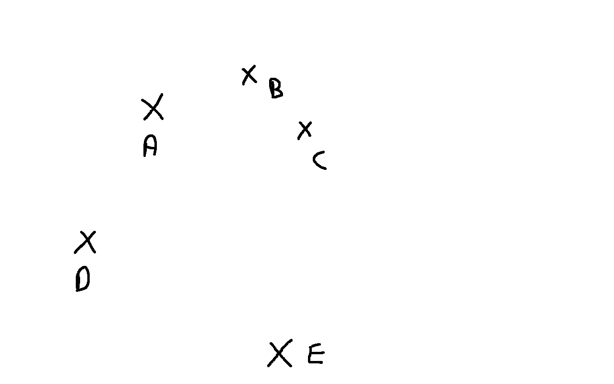

# OPV Graphe

**This module is a future [OpenPathView](http://opv.li/) module in active developpment.**


<html>
      <strong>This document is written in Broken English</strong><br/>
      <strong>This module is still in active developpement, don't used it in production</strong><br />
      The goal of this module is to create virtual tour from a campaign of panorama taken in a hiking session. <br />
      At the end of the session, you only have the GPS position of the panorama, and it's not simple to link all panorama together to create a virtual tour. A simple way
      to resovle this problem is to take the hour of each panorama as a parameter to link them. But if you have multiples cameras or your cameras are not really precise
       (like time reset), you can't really create a "precise" tour. <br />
      The purpose of this module is to create the most precise tour with only the GPS position of each panrama. To resolv this problem, this module used Graphe and alogrithm like:
      <ul>
        <li>Breadth First Search</h1>
        <li>Dijktra</li>
      </ul>
      The main step of the resolution of this problems are:
      <ul>
        <li>1) Create node in graphe with GPS point of each panorama</li>
        <li>2) Detect near nodes between each nodes</li>
        <li>3) Detect subgraphe and merge them</li>
        <li>4) Search endpoints of the merge graphe</li>
        <li>5) Compute path between endpoints and hotpoints and reduce the graphe</li>
        <li>6) Reduce the node number (take one paramater each X meters)</li>
      </ul>
    </p>
</html>


## Installation

Create a virtualenv to test it

```bash
pyvenv venv
```

Install requirements

```bash
pip install -r requirements.txt
```

## How to launch

You can launch the api with this command:

```bash
gunicorn --bind 0.0.0.0:5000 opv.graphe.__main__:app -w 8
```

## How to test

The api came with a swagger, you can use it:

[http://127.0.0.1:5000/apidocs/](http://127.0.0.1:5000/apidocs/)

<br />

You can test with our campaign at [Parc national des Ecrins](http://www.ecrins-parcnational.fr/):

```json
{"nodes": [{"y": 6.465153, "z": 1668.255, "data": {}, "id": "305", "x": 44.979825}, {"y": 6.459916, "z": 1737.331, "data": {}, "id": "400", "x": 44.976939}, {"y": 6.468979, "z": 1614.109, "data": {}, "id": "834", "x": 44.981782}, {"y": 6.462052, "z": 1713.636, "data": {}, "id": "432", "x": 44.977576}, {"y": 6.470842, "z": 1903.299, "data": {}, "id": "666", "x": 45.023262}, {"y": 6.478334, "z": 1529.896, "data": {}, "id": "705", "x": 44.985757}, {"y": 6.466988, "z": 1745.15, "data": {}, "id": "501", "x": 45.016147}, {"y": 6.463152, "z": 1695.933, "data": {}, "id": "360", "x": 44.97876}, {"y": 6.463329, "z": 1693.174, "data": {}, "id": "340", "x": 44.978805}, {"y": 6.462914, "z": 1696.24, "data": {}, "id": "370", "x": 44.978369}, {"y": 6.465424, "z": 1670.241, "data": {}, "id": "298", "x": 44.979948}, {"y": 6.467323, "z": 1633.405, "data": {}, "id": "827", "x": 44.981015}, {"y": 6.469765, "z": 1605.102, "data": {}, "id": "159", "x": 44.982838}, {"y": 6.464821, "z": 1676.05, "data": {}, "id": "326", "x": 44.979462}, {"y": 6.463974, "z": 1683.517, "data": {}, "id": "332", "x": 44.979043}, {"y": 6.470738, "z": 1584.591, "data": {}, "id": "130", "x": 44.983079}, {"y": 6.47011, "z": 1803.317, "data": {}, "id": "562", "x": 45.01842}, {"y": 6.470531, "z": 1887.87, "data": {}, "id": "641", "x": 45.022277}, {"y": 6.462587, "z": 1709.295, "data": {}, "id": "434", "x": 44.977832}, {"y": 6.47078, "z": 1891.452, "data": {}, "id": "661", "x": 45.02279}, {"y": 6.47189, "z": 1912.825, "data": {}, "id": "668", "x": 45.023839}, {"y": 6.466165, "z": 1664.356, "data": {}, "id": "280", "x": 44.980116}, {"y": 6.475282, "z": 1545.87, "data": {}, "id": "52", "x": 44.984781}, {"y": 6.469855, "z": 1829.161, "data": {}, "id": "584", "x": 45.019209}, {"y": 6.458801, "z": 1749.327, "data": {}, "id": "469", "x": 44.976847}, {"y": 6.471432, "z": 1561.555, "data": {}, "id": "769", "x": 44.983789}, {"y": 6.458865, "z": 1747.942, "data": {}, "id": "451", "x": 44.976857}, {"y": 6.469532, "z": 1603.993, "data": {}, "id": "809", "x": 44.98263}, {"y": 6.471471, "z": 1556.492, "data": {}, "id": "742", "x": 44.983796}, {"y": 6.458174, "z": 1759.674, "data": {}, "id": "466", "x": 44.976679}, {"y": 6.462968, "z": 1697.839, "data": {}, "id": "375", "x": 44.978512}, {"y": 6.471462, "z": 1574.47, "data": {}, "id": "783", "x": 44.983742}, {"y": 6.469402, "z": 1605.488, "data": {}, "id": "166", "x": 44.982514}, {"y": 6.468416, "z": 1618.202, "data": {}, "id": "198", "x": 44.981708}, {"y": 6.468613, "z": 1618.058, "data": {}, "id": "196", "x": 44.981729}, {"y": 6.472685, "z": 1561.416, "data": {}, "id": "732", "x": 44.984198}, {"y": 6.471487, "z": 1567.391, "data": {}, "id": "89", "x": 44.983818}, {"y": 6.470476, "z": 1584.01, "data": {}, "id": "140", "x": 44.983337}, {"y": 6.474691, "z": 1554.174, "data": {}, "id": "48", "x": 44.984604}, {"y": 6.460159, "z": 1731.669, "data": {}, "id": "392", "x": 44.976951}, {"y": 6.466455, "z": 1648.75, "data": {}, "id": "868", "x": 44.980649}, {"y": 6.470773, "z": 1899.751, "data": {}, "id": "656", "x": 45.023103}, {"y": 6.462813, "z": 1705.212, "data": {}, "id": "420", "x": 44.978047}, {"y": 6.469818, "z": 1835.939, "data": {}, "id": "590", "x": 45.019385}, {"y": 6.469051, "z": 1608.888, "data": {}, "id": "189", "x": 44.982207}, {"y": 6.467947, "z": 1770.921, "data": {}, "id": "519", "x": 45.017261}, {"y": 6.470121, "z": 1873.245, "data": {}, "id": "565", "x": 45.021578}, {"y": 6.466034, "z": 1665.926, "data": {}, "id": "290", "x": 44.980104}, {"y": 6.47238, "z": 1562.088, "data": {}, "id": "78", "x": 44.984108}, {"y": 6.469744, "z": 1846.287, "data": {}, "id": "613", "x": 45.020308}, {"y": 6.459553, "z": 1739.019, "data": {}, "id": "413", "x": 44.976842}, {"y": 6.457327, "z": 1769.812, "data": {}, "id": "474", "x": 44.97673}, {"y": 6.467155, "z": 1636.223, "data": {}, "id": "849", "x": 44.980887}, {"y": 6.473842, "z": 1559.116, "data": {}, "id": "66", "x": 44.984511}, {"y": 6.467922, "z": 1623.116, "data": {}, "id": "174", "x": 44.981543}, {"y": 6.471093, "z": 1909.453, "data": {}, "id": "670", "x": 45.023308}, {"y": 6.47738, "z": 1536.843, "data": {}, "id": "20", "x": 44.985465}, {"y": 6.462172, "z": 1710.975, "data": {}, "id": "423", "x": 44.977617}, {"y": 6.462773, "z": 1707.917, "data": {}, "id": "403", "x": 44.978059}, {"y": 6.470791, "z": 1893.998, "data": {}, "id": "663", "x": 45.022691}, {"y": 6.465977, "z": 1666.115, "data": {}, "id": "288", "x": 44.980086}, {"y": 6.469728, "z": 1605.934, "data": {}, "id": "155", "x": 44.982801}, {"y": 6.469843, "z": 1600.102, "data": {}, "id": "160", "x": 44.982915}, {"y": 6.469918, "z": 1842.68, "data": {}, "id": "611", "x": 45.01985}, {"y": 6.467432, "z": 1744.553, "data": {}, "id": "508", "x": 45.016094}, {"y": 6.466213, "z": 1662.136, "data": {}, "id": "282", "x": 44.980174}, {"y": 6.465695, "z": 1648.979, "data": {}, "id": "271", "x": 44.980507}, {"y": 6.468016, "z": 1755.218, "data": {}, "id": "513", "x": 45.016251}, {"y": 6.460984, "z": 1725.138, "data": {}, "id": "380", "x": 44.977168}, {"y": 6.460027, "z": 1732.192, "data": {}, "id": "407", "x": 44.976965}, {"y": 6.465716, "z": 1660.973, "data": {}, "id": "274", "x": 44.98022}, {"y": 6.465781, "z": 1664.031, "data": {}, "id": "286", "x": 44.980245}, {"y": 6.471958, "z": 1562.417, "data": {}, "id": "759", "x": 44.983972}, {"y": 6.478266, "z": 1538.111, "data": {}, "id": "13", "x": 44.985716}, {"y": 6.466836, "z": 1641.117, "data": {}, "id": "236", "x": 44.980751}, {"y": 6.470102, "z": 1799.363, "data": {}, "id": "581", "x": 45.018331}, {"y": 6.465308, "z": 1670.414, "data": {}, "id": "301", "x": 44.979907}, {"y": 6.466764, "z": 1646.978, "data": {}, "id": "828", "x": 44.980727}, {"y": 6.461397, "z": 1714.546, "data": {}, "id": "442", "x": 44.977391}, {"y": 6.468235, "z": 1628.391, "data": {}, "id": "179", "x": 44.981228}, {"y": 6.468225, "z": 1617.947, "data": {}, "id": "839", "x": 44.981715}, {"y": 6.471026, "z": 1585.924, "data": {}, "id": "774", "x": 44.983131}, {"y": 6.462751, "z": 1709.951, "data": {}, "id": "394", "x": 44.978044}, {"y": 6.469895, "z": 1841.255, "data": {}, "id": "600", "x": 45.019619}, {"y": 6.475855, "z": 1542.968, "data": {}, "id": "739", "x": 44.985081}, {"y": 6.470709, "z": 1584.528, "data": {}, "id": "136", "x": 44.983121}, {"y": 6.481462, "z": 1528.918, "data": {}, "id": "700", "x": 44.987414}, {"y": 6.465656, "z": 1665.812, "data": {}, "id": "293", "x": 44.980015}, {"y": 6.47281, "z": 1922.763, "data": {}, "id": "676", "x": 45.024293}, {"y": 6.468963, "z": 1781.397, "data": {}, "id": "530", "x": 45.01788}, {"y": 6.464903, "z": 1672.21, "data": {}, "id": "311", "x": 44.979632}, {"y": 6.469851, "z": 1830.263, "data": {}, "id": "597", "x": 45.019328}, {"y": 6.470403, "z": 1583.362, "data": {}, "id": "142", "x": 44.983475}, {"y": 6.477894, "z": 1536.561, "data": {}, "id": "15", "x": 44.985587}, {"y": 6.481404, "z": 1527.715, "data": {}, "id": "4", "x": 44.987418}, {"y": 6.463772, "z": 1682.359, "data": {}, "id": "348", "x": 44.97903}, {"y": 6.470008, "z": 1815.402, "data": {}, "id": "585", "x": 45.01881}, {"y": 6.477342, "z": 1537.184, "data": {}, "id": "696", "x": 44.985458}, {"y": 6.469865, "z": 1811.915, "data": {}, "id": "573", "x": 45.0187}, {"y": 6.466255, "z": 1648.216, "data": {}, "id": "244", "x": 44.980554}, {"y": 6.459618, "z": 1737.433, "data": {}, "id": "418", "x": 44.976847}, {"y": 6.470015, "z": 1843.013, "data": {}, "id": "609", "x": 45.019784}, {"y": 6.472565, "z": 1561.319, "data": {}, "id": "77", "x": 44.984151}, {"y": 6.467435, "z": 1633.806, "data": {}, "id": "856", "x": 44.981101}, {"y": 6.466107, "z": 1665.708, "data": {}, "id": "284", "x": 44.980102}, {"y": 6.470369, "z": 1879.235, "data": {}, "id": "622", "x": 45.022139}, {"y": 6.462532, "z": 1709.344, "data": {}, "id": "436", "x": 44.97781}, {"y": 6.461038, "z": 1726.743, "data": {}, "id": "385", "x": 44.977199}, {"y": 6.469948, "z": 1813.92, "data": {}, "id": "582", "x": 45.018804}, {"y": 6.459952, "z": 1734.337, "data": {}, "id": "408", "x": 44.976972}, {"y": 6.467892, "z": 1624.255, "data": {}, "id": "209", "x": 44.981594}, {"y": 6.464267, "z": 1681.431, "data": {}, "id": "318", "x": 44.979162}, {"y": 6.468112, "z": 1774.401, "data": {}, "id": "524", "x": 45.017327}, {"y": 6.470522, "z": 1897.131, "data": {}, "id": "636", "x": 45.022194}, {"y": 6.465521, "z": 1654.489, "data": {}, "id": "249", "x": 44.980583}, {"y": 6.460453, "z": 1726.733, "data": {}, "id": "384", "x": 44.977034}, {"y": 6.471228, "z": 1573.862, "data": {}, "id": "779", "x": 44.983566}, {"y": 6.458436, "z": 1760.875, "data": {}, "id": "459", "x": 44.976671}, {"y": 6.471498, "z": 1566.115, "data": {}, "id": "766", "x": 44.983753}, {"y": 6.464521, "z": 1676.617, "data": {}, "id": "316", "x": 44.979324}, {"y": 6.47045, "z": 1581.928, "data": {}, "id": "139", "x": 44.983376}, {"y": 6.464606, "z": 1675.589, "data": {}, "id": "315", "x": 44.979377}, {"y": 6.478245, "z": 1533.425, "data": {}, "id": "12", "x": 44.985704}, {"y": 6.47702, "z": 1543.799, "data": {}, "id": "22", "x": 44.98539}, {"y": 6.474996, "z": 1551.787, "data": {}, "id": "712", "x": 44.984667}, {"y": 6.469706, "z": 1790.426, "data": {}, "id": "534", "x": 45.018219}, {"y": 6.45985, "z": 1738.25, "data": {}, "id": "399", "x": 44.976916}, {"y": 6.468091, "z": 1619.24, "data": {}, "id": "203", "x": 44.981724}, {"y": 6.469904, "z": 1835.813, "data": {}, "id": "594", "x": 45.019531}, {"y": 6.465245, "z": 1658.637, "data": {}, "id": "878", "x": 44.980392}, {"y": 6.467891, "z": 1622.887, "data": {}, "id": "211", "x": 44.981623}, {"y": 6.481268, "z": 1527.475, "data": {}, "id": "683", "x": 44.987432}, {"y": 6.460339, "z": 1732.225, "data": {}, "id": "387", "x": 44.976997}, {"y": 6.466466, "z": 1730.314, "data": {}, "id": "495", "x": 45.017389}, {"y": 6.46248, "z": 1710.855, "data": {}, "id": "435", "x": 44.977778}, {"y": 6.473767, "z": 1559.029, "data": {}, "id": "68", "x": 44.984483}, {"y": 6.470106, "z": 1804.699, "data": {}, "id": "568", "x": 45.018515}, {"y": 6.469861, "z": 1823.734, "data": {}, "id": "591", "x": 45.01903}, {"y": 6.476589, "z": 1542.623, "data": {}, "id": "692", "x": 44.985316}, {"y": 6.469013, "z": 1783.52, "data": {}, "id": "533", "x": 45.017915}, {"y": 6.477993, "z": 1535.639, "data": {}, "id": "14", "x": 44.985619}, {"y": 6.463572, "z": 1682.431, "data": {}, "id": "343", "x": 44.978725}, {"y": 6.467284, "z": 1633.916, "data": {}, "id": "857", "x": 44.981047}, {"y": 6.465858, "z": 1649.076, "data": {}, "id": "889", "x": 44.980565}, {"y": 6.465972, "z": 1646.257, "data": {}, "id": "884", "x": 44.980571}, {"y": 6.467105, "z": 1726.622, "data": {}, "id": "494", "x": 45.018123}, {"y": 6.470015, "z": 1864.021, "data": {}, "id": "547", "x": 45.021175}, {"y": 6.463221, "z": 1702.881, "data": {}, "id": "364", "x": 44.978759}, {"y": 6.468072, "z": 1758.118, "data": {}, "id": "511", "x": 45.016034}, {"y": 6.462956, "z": 1696.876, "data": {}, "id": "376", "x": 44.97846}, {"y": 6.469027, "z": 1613.26, "data": {}, "id": "822", "x": 44.981812}, {"y": 6.477818, "z": 1538.529, "data": {}, "id": "687", "x": 44.985577}, {"y": 6.468021, "z": 1620.485, "data": {}, "id": "854", "x": 44.981712}, {"y": 6.467496, "z": 1744.327, "data": {}, "id": "509", "x": 45.016093}, {"y": 6.471258, "z": 1575.746, "data": {}, "id": "111", "x": 44.983607}, {"y": 6.469758, "z": 1851.151, "data": {}, "id": "617", "x": 45.020393}, {"y": 6.465647, "z": 1661.431, "data": {}, "id": "875", "x": 44.980235}, {"y": 6.470406, "z": 1881.603, "data": {}, "id": "632", "x": 45.022164}, {"y": 6.457194, "z": 1771.435, "data": {}, "id": "477", "x": 44.976731}, {"y": 6.470504, "z": 1893.375, "data": {}, "id": "642", "x": 45.02229}, {"y": 6.469619, "z": 1602.875, "data": {}, "id": "814", "x": 44.982689}, {"y": 6.456716, "z": 1775.191, "data": {}, "id": "483", "x": 44.976641}, {"y": 6.469131, "z": 1609.826, "data": {}, "id": "185", "x": 44.981861}, {"y": 6.472307, "z": 1562.031, "data": {}, "id": "80", "x": 44.98409}, {"y": 6.469875, "z": 1811.774, "data": {}, "id": "574", "x": 45.018744}, {"y": 6.462992, "z": 1695.299, "data": {}, "id": "374", "x": 44.978595}, {"y": 6.47432, "z": 1555.311, "data": {}, "id": "724", "x": 44.984559}, {"y": 6.47252, "z": 1919.446, "data": {}, "id": "669", "x": 45.024125}, {"y": 6.470031, "z": 1869.773, "data": {}, "id": "552", "x": 45.02146}, {"y": 6.467501, "z": 1765.369, "data": {}, "id": "516", "x": 45.016725}, {"y": 6.470824, "z": 1905.583, "data": {}, "id": "674", "x": 45.02322}, {"y": 6.470192, "z": 1588.165, "data": {}, "id": "799", "x": 44.983401}, {"y": 6.477494, "z": 1535.285, "data": {}, "id": "19", "x": 44.985512}, {"y": 6.472974, "z": 1559.314, "data": {}, "id": "753", "x": 44.984263}, {"y": 6.465403, "z": 1657.308, "data": {}, "id": "283", "x": 44.980298}, {"y": 6.474755, "z": 1553.962, "data": {}, "id": "718", "x": 44.984609}, {"y": 6.471601, "z": 1568.751, "data": {}, "id": "737", "x": 44.983849}, {"y": 6.468254, "z": 1625.291, "data": {}, "id": "177", "x": 44.981269}, {"y": 6.469905, "z": 1596.545, "data": {}, "id": "152", "x": 44.982989}, {"y": 6.465622, "z": 1666.254, "data": {}, "id": "297", "x": 44.979992}, {"y": 6.464111, "z": 1685.299, "data": {}, "id": "329", "x": 44.979098}, {"y": 6.469899, "z": 1795.9, "data": {}, "id": "538", "x": 45.01823}, {"y": 6.46028, "z": 1731.529, "data": {}, "id": "391", "x": 44.976981}, {"y": 6.467958, "z": 1618.924, "data": {}, "id": "842", "x": 44.981705}, {"y": 6.470055, "z": 1841.803, "data": {}, "id": "606", "x": 45.019705}, {"y": 6.47834, "z": 1544.205, "data": {}, "id": "704", "x": 44.98576}, {"y": 6.46926, "z": 1605.252, "data": {}, "id": "169", "x": 44.982431}, {"y": 6.465023, "z": 1671.439, "data": {}, "id": "261", "x": 44.979676}, {"y": 6.457493, "z": 1768.912, "data": {}, "id": "478", "x": 44.976767}, {"y": 6.459687, "z": 1737.451, "data": {}, "id": "412", "x": 44.97685}, {"y": 6.46607, "z": 1647.982, "data": {}, "id": "881", "x": 44.980546}, {"y": 6.473649, "z": 1554.279, "data": {}, "id": "726", "x": 44.984438}, {"y": 6.46816, "z": 1775.95, "data": {}, "id": "522", "x": 45.017362}, {"y": 6.471013, "z": 1911.941, "data": {}, "id": "664", "x": 45.023345}, {"y": 6.469702, "z": 1605.998, "data": {}, "id": "807", "x": 44.982758}, {"y": 6.474192, "z": 1941.623, "data": {}, "id": "678", "x": 45.025005}, {"y": 6.475917, "z": 1542.873, "data": {}, "id": "36", "x": 44.985102}, {"y": 6.469967, "z": 1843.742, "data": {}, "id": "607", "x": 45.019813}, {"y": 6.476207, "z": 1542.778, "data": {}, "id": "28", "x": 44.985203}, {"y": 6.465717, "z": 1666.039, "data": {}, "id": "294", "x": 44.980031}, {"y": 6.470787, "z": 1901.804, "data": {}, "id": "650", "x": 45.022904}, {"y": 6.470193, "z": 1873.967, "data": {}, "id": "570", "x": 45.021715}, {"y": 6.461336, "z": 1716.798, "data": {}, "id": "389", "x": 44.977371}, {"y": 6.460507, "z": 1726.335, "data": {}, "id": "448", "x": 44.977057}, {"y": 6.460104, "z": 1732.299, "data": {}, "id": "409", "x": 44.976964}, {"y": 6.472612, "z": 1560.963, "data": {}, "id": "733", "x": 44.984173}, {"y": 6.458108, "z": 1760.177, "data": {}, "id": "460", "x": 44.976702}, {"y": 6.47012, "z": 1590.449, "data": {}, "id": "147", "x": 44.983336}, {"y": 6.465042, "z": 1671.085, "data": {}, "id": "310", "x": 44.979703}, {"y": 6.462774, "z": 1693.177, "data": {}, "id": "378", "x": 44.978103}, {"y": 6.468478, "z": 1616.372, "data": {}, "id": "843", "x": 44.9817}, {"y": 6.467369, "z": 1745.458, "data": {}, "id": "504", "x": 45.016099}, {"y": 6.470201, "z": 1874.096, "data": {}, "id": "566", "x": 45.021809}, {"y": 6.463344, "z": 1683.417, "data": {}, "id": "338", "x": 44.978709}, {"y": 6.468142, "z": 1623.392, "data": {}, "id": "190", "x": 44.981397}, {"y": 6.46823, "z": 1623.947, "data": {}, "id": "817", "x": 44.981316}, {"y": 6.470107, "z": 1803.523, "data": {}, "id": "572", "x": 45.018555}, {"y": 6.470574, "z": 1880.946, "data": {}, "id": "645", "x": 45.02222}, {"y": 6.463102, "z": 1693.104, "data": {}, "id": "368", "x": 44.978753}, {"y": 6.47335, "z": 1557.236, "data": {}, "id": "72", "x": 44.984357}, {"y": 6.465902, "z": 1664.95, "data": {}, "id": "287", "x": 44.980224}, {"y": 6.473483, "z": 1556.554, "data": {}, "id": "752", "x": 44.984403}, {"y": 6.467963, "z": 1623.186, "data": {}, "id": "176", "x": 44.981512}, {"y": 6.470683, "z": 1584.962, "data": {}, "id": "133", "x": 44.983166}, {"y": 6.476089, "z": 1542.934, "data": {}, "id": "35", "x": 44.985158}, {"y": 6.466891, "z": 1640.117, "data": {}, "id": "863", "x": 44.980756}, {"y": 6.469655, "z": 1604.12, "data": {}, "id": "156", "x": 44.982727}, {"y": 6.468748, "z": 1779.222, "data": {}, "id": "526", "x": 45.017706}, {"y": 6.461945, "z": 1715.074, "data": {}, "id": "433", "x": 44.977527}, {"y": 6.470009, "z": 1863.899, "data": {}, "id": "551", "x": 45.021221}, {"y": 6.461758, "z": 1714.736, "data": {}, "id": "430", "x": 44.977475}, {"y": 6.460689, "z": 1724.793, "data": {}, "id": "386", "x": 44.977075}, {"y": 6.45767, "z": 1763.115, "data": {}, "id": "484", "x": 44.976767}, {"y": 6.45688, "z": 1773.998, "data": {}, "id": "486", "x": 44.976736}, {"y": 6.470977, "z": 1911.841, "data": {}, "id": "660", "x": 45.023334}, {"y": 6.464695, "z": 1679.061, "data": {}, "id": "319", "x": 44.97947}, {"y": 6.471037, "z": 1570.231, "data": {}, "id": "115", "x": 44.983441}, {"y": 6.47078, "z": 1901.232, "data": {}, "id": "653", "x": 45.023058}, {"y": 6.474014, "z": 1555.888, "data": {}, "id": "62", "x": 44.984551}, {"y": 6.466949, "z": 1639.696, "data": {}, "id": "860", "x": 44.980769}, {"y": 6.476947, "z": 1543.587, "data": {}, "id": "25", "x": 44.985389}, {"y": 6.465331, "z": 1658.028, "data": {}, "id": "300", "x": 44.980566}, {"y": 6.470207, "z": 1586.609, "data": {}, "id": "803", "x": 44.983464}, {"y": 6.465457, "z": 1655.672, "data": {}, "id": "250", "x": 44.98058}, {"y": 6.461132, "z": 1725.275, "data": {}, "id": "379", "x": 44.97726}, {"y": 6.474563, "z": 1554.379, "data": {}, "id": "722", "x": 44.984601}, {"y": 6.467915, "z": 1622.759, "data": {}, "id": "202", "x": 44.981685}, {"y": 6.476828, "z": 1541.752, "data": {}, "id": "689", "x": 44.985367}, {"y": 6.471413, "z": 1553.143, "data": {}, "id": "86", "x": 44.983742}, {"y": 6.476899, "z": 1542.426, "data": {}, "id": "711", "x": 44.985378}, {"y": 6.457634, "z": 1762.78, "data": {}, "id": "491", "x": 44.976776}, {"y": 6.467902, "z": 1756.971, "data": {}, "id": "514", "x": 45.016292}, {"y": 6.471354, "z": 1574.941, "data": {}, "id": "109", "x": 44.983685}, {"y": 6.464035, "z": 1685.402, "data": {}, "id": "331", "x": 44.979055}, {"y": 6.46223, "z": 1710.193, "data": {}, "id": "427", "x": 44.977633}, {"y": 6.457244, "z": 1770.227, "data": {}, "id": "475", "x": 44.976741}, {"y": 6.469487, "z": 1605.328, "data": {}, "id": "164", "x": 44.982586}, {"y": 6.474113, "z": 1555.003, "data": {}, "id": "61", "x": 44.984547}, {"y": 6.470013, "z": 1820.687, "data": {}, "id": "583", "x": 45.018884}, {"y": 6.466732, "z": 1742.14, "data": {}, "id": "506", "x": 45.016188}, {"y": 6.470795, "z": 1568.617, "data": {}, "id": "120", "x": 44.983484}, {"y": 6.465783, "z": 1667.404, "data": {}, "id": "292", "x": 44.98004}, {"y": 6.464461, "z": 1680.618, "data": {}, "id": "325", "x": 44.979281}, {"y": 6.464554, "z": 1675.456, "data": {}, "id": "314", "x": 44.979347}, {"y": 6.465574, "z": 1651.139, "data": {}, "id": "248", "x": 44.98056}, {"y": 6.470568, "z": 1881.643, "data": {}, "id": "633", "x": 45.022252}, {"y": 6.467561, "z": 1745.866, "data": {}, "id": "505", "x": 45.016094}, {"y": 6.469995, "z": 1843.511, "data": {}, "id": "605", "x": 45.019678}, {"y": 6.467941, "z": 1633.716, "data": {}, "id": "210", "x": 44.981231}, {"y": 6.468136, "z": 1629.751, "data": {}, "id": "181", "x": 44.981193}, {"y": 6.459808, "z": 1737.556, "data": {}, "id": "401", "x": 44.976887}, {"y": 6.462881, "z": 1689.164, "data": {}, "id": "369", "x": 44.978231}, {"y": 6.463217, "z": 1692.479, "data": {}, "id": "352", "x": 44.978776}, {"y": 6.466674, "z": 1635.207, "data": {}, "id": "231", "x": 44.980726}, {"y": 6.47079, "z": 1895.198, "data": {}, "id": "646", "x": 45.022867}, {"y": 6.475227, "z": 1547.609, "data": {}, "id": "53", "x": 44.984748}, {"y": 6.4568, "z": 1774.406, "data": {}, "id": "482", "x": 44.976663}, {"y": 6.463623, "z": 1680.71, "data": {}, "id": "335", "x": 44.978894}, {"y": 6.479418, "z": 1536.305, "data": {}, "id": "699", "x": 44.986159}, {"y": 6.47462, "z": 1554.099, "data": {}, "id": "46", "x": 44.984629}, {"y": 6.467566, "z": 1763.57, "data": {}, "id": "515", "x": 45.016805}, {"y": 6.473949, "z": 1563.791, "data": {}, "id": "67", "x": 44.984545}, {"y": 6.469879, "z": 1836.794, "data": {}, "id": "598", "x": 45.019482}, {"y": 6.469929, "z": 1820.88, "data": {}, "id": "592", "x": 45.018951}, {"y": 6.469074, "z": 1608.188, "data": {}, "id": "171", "x": 44.982377}, {"y": 6.466117, "z": 1647.44, "data": {}, "id": "247", "x": 44.98054}, {"y": 6.470792, "z": 1901.86, "data": {}, "id": "655", "x": 45.023004}, {"y": 6.468837, "z": 1618.715, "data": {}, "id": "837", "x": 44.981714}, {"y": 6.473059, "z": 1558.462, "data": {}, "id": "729", "x": 44.984287}, {"y": 6.468745, "z": 1621.657, "data": {}, "id": "824", "x": 44.981731}, {"y": 6.471099, "z": 1584.915, "data": {}, "id": "789", "x": 44.983265}, {"y": 6.468072, "z": 1630.237, "data": {}, "id": "182", "x": 44.981204}, {"y": 6.469942, "z": 1857.131, "data": {}, "id": "536", "x": 45.020715}, {"y": 6.46487, "z": 1672.9, "data": {}, "id": "307", "x": 44.979583}, {"y": 6.470824, "z": 1906.272, "data": {}, "id": "672", "x": 45.023171}, {"y": 6.469286, "z": 1786.767, "data": {}, "id": "528", "x": 45.0181}, {"y": 6.461077, "z": 1727.724, "data": {}, "id": "455", "x": 44.977226}, {"y": 6.464837, "z": 1673.435, "data": {}, "id": "269", "x": 44.979541}, {"y": 6.471411, "z": 1568.986, "data": {}, "id": "108", "x": 44.983709}, {"y": 6.463448, "z": 1683.282, "data": {}, "id": "346", "x": 44.978709}, {"y": 6.470953, "z": 1909.902, "data": {}, "id": "662", "x": 45.023363}, {"y": 6.469892, "z": 1598.117, "data": {}, "id": "153", "x": 44.98295}, {"y": 6.462285, "z": 1710.324, "data": {}, "id": "422", "x": 44.977661}, {"y": 6.463717, "z": 1681.682, "data": {}, "id": "351", "x": 44.979018}, {"y": 6.467702, "z": 1637.714, "data": {}, "id": "217", "x": 44.981235}, {"y": 6.475747, "z": 1545.157, "data": {}, "id": "45", "x": 44.985027}, {"y": 6.46711, "z": 1746.836, "data": {}, "id": "502", "x": 45.016121}, {"y": 6.481078, "z": 1529.054, "data": {}, "id": "681", "x": 44.987401}, {"y": 6.460394, "z": 1728.752, "data": {}, "id": "390", "x": 44.977016}, {"y": 6.47025, "z": 1877.385, "data": {}, "id": "608", "x": 45.021872}, {"y": 6.470215, "z": 1875.193, "data": {}, "id": "569", "x": 45.021841}, {"y": 6.473236, "z": 1557.005, "data": {}, "id": "73", "x": 44.984321}, {"y": 6.461449, "z": 1713.333, "data": {}, "id": "437", "x": 44.977408}, {"y": 6.46304, "z": 1692.137, "data": {}, "id": "363", "x": 44.978685}, {"y": 6.476762, "z": 1541.965, "data": {}, "id": "690", "x": 44.985355}, {"y": 6.475119, "z": 1551.24, "data": {}, "id": "56", "x": 44.984697}, {"y": 6.471465, "z": 1565.381, "data": {}, "id": "772", "x": 44.983809}, {"y": 6.471458, "z": 1567.65, "data": {}, "id": "765", "x": 44.983707}, {"y": 6.465239, "z": 1653.242, "data": {}, "id": "306", "x": 44.980492}, {"y": 6.459365, "z": 1746.867, "data": {}, "id": "441", "x": 44.976833}, {"y": 6.458577, "z": 1749.871, "data": {}, "id": "453", "x": 44.976754}, {"y": 6.474262, "z": 1554.91, "data": {}, "id": "59", "x": 44.984556}, {"y": 6.471499, "z": 1570.807, "data": {}, "id": "101", "x": 44.983744}, {"y": 6.47007, "z": 1805.382, "data": {}, "id": "579", "x": 45.018597}, {"y": 6.470919, "z": 1586.218, "data": {}, "id": "129", "x": 44.983067}, {"y": 6.46777, "z": 1637.928, "data": {}, "id": "207", "x": 44.98125}, {"y": 6.457926, "z": 1762.163, "data": {}, "id": "470", "x": 44.976722}, {"y": 6.469856, "z": 1831.216, "data": {}, "id": "588", "x": 45.019257}, {"y": 6.476638, "z": 1541.918, "data": {}, "id": "24", "x": 44.985316}, {"y": 6.476519, "z": 1541.535, "data": {}, "id": "27", "x": 44.985296}, {"y": 6.468406, "z": 1777.328, "data": {}, "id": "521", "x": 45.017505}, {"y": 6.462333, "z": 1707.717, "data": {}, "id": "421", "x": 44.977698}, {"y": 6.465271, "z": 1653.714, "data": {}, "id": "304", "x": 44.980522}, {"y": 6.466798, "z": 1654.767, "data": {}, "id": "833", "x": 44.980717}, {"y": 6.469758, "z": 1846.834, "data": {}, "id": "624", "x": 45.020178}, {"y": 6.470866, "z": 1587.111, "data": {}, "id": "794", "x": 44.983051}, {"y": 6.469805, "z": 1854.505, "data": {}, "id": "542", "x": 45.020624}, {"y": 6.470114, "z": 1593.14, "data": {}, "id": "148", "x": 44.983276}, {"y": 6.464944, "z": 1672.345, "data": {}, "id": "309", "x": 44.979644}, {"y": 6.470549, "z": 1584.83, "data": {}, "id": "801", "x": 44.983262}, {"y": 6.468543, "z": 1615.028, "data": {}, "id": "208", "x": 44.981714}, {"y": 6.4634, "z": 1683.729, "data": {}, "id": "341", "x": 44.978708}, {"y": 6.462883, "z": 1696.464, "data": {}, "id": "373", "x": 44.978337}, {"y": 6.45708, "z": 1771.42, "data": {}, "id": "481", "x": 44.976707}, {"y": 6.471411, "z": 1565.774, "data": {}, "id": "90", "x": 44.983754}, {"y": 6.469754, "z": 1854.677, "data": {}, "id": "620", "x": 45.020488}, {"y": 6.470895, "z": 1907.18, "data": {}, "id": "673", "x": 45.023352}, {"y": 6.46996, "z": 1808.945, "data": {}, "id": "576", "x": 45.018647}, {"y": 6.465106, "z": 1669.652, "data": {}, "id": "872", "x": 44.979796}, {"y": 6.4682, "z": 1629.555, "data": {}, "id": "818", "x": 44.981201}, {"y": 6.463286, "z": 1692.804, "data": {}, "id": "350", "x": 44.978766}, {"y": 6.469022, "z": 1608.952, "data": {}, "id": "186", "x": 44.982342}, {"y": 6.47745, "z": 1534.965, "data": {}, "id": "21", "x": 44.985496}, {"y": 6.469171, "z": 1610.46, "data": {}, "id": "821", "x": 44.981902}, {"y": 6.458314, "z": 1760.6, "data": {}, "id": "468", "x": 44.976673}, {"y": 6.463076, "z": 1693.823, "data": {}, "id": "361", "x": 44.978714}, {"y": 6.470505, "z": 1584.214, "data": {}, "id": "138", "x": 44.98329}, {"y": 6.465918, "z": 1646.624, "data": {}, "id": "883", "x": 44.980575}, {"y": 6.465761, "z": 1649.67, "data": {}, "id": "272", "x": 44.980527}, {"y": 6.469956, "z": 1862.273, "data": {}, "id": "549", "x": 45.021341}, {"y": 6.465639, "z": 1649.592, "data": {}, "id": "275", "x": 44.980532}, {"y": 6.462385, "z": 1708.744, "data": {}, "id": "419", "x": 44.977722}, {"y": 6.474068, "z": 1554.596, "data": {}, "id": "60", "x": 44.984538}, {"y": 6.471455, "z": 1566.154, "data": {}, "id": "763", "x": 44.983785}, {"y": 6.471399, "z": 1565.451, "data": {}, "id": "93", "x": 44.983711}, {"y": 6.471458, "z": 1571.232, "data": {}, "id": "97", "x": 44.983715}, {"y": 6.466755, "z": 1639.971, "data": {}, "id": "861", "x": 44.980755}, {"y": 6.467001, "z": 1639.916, "data": {}, "id": "228", "x": 44.980795}, {"y": 6.472254, "z": 1563.052, "data": {}, "id": "79", "x": 44.984069}, {"y": 6.463626, "z": 1682.158, "data": {}, "id": "356", "x": 44.978768}, {"y": 6.470501, "z": 1880.921, "data": {}, "id": "634", "x": 45.022254}, {"y": 6.458491, "z": 1759.244, "data": {}, "id": "458", "x": 44.976693}, {"y": 6.470781, "z": 1892.746, "data": {}, "id": "649", "x": 45.022746}, {"y": 6.471169, "z": 1578.083, "data": {}, "id": "116", "x": 44.983433}, {"y": 6.473892, "z": 1940.999, "data": {}, "id": "677", "x": 45.024822}, {"y": 6.463838, "z": 1682.681, "data": {}, "id": "349", "x": 44.979031}, {"y": 6.473895, "z": 1560.758, "data": {}, "id": "63", "x": 44.98453}, {"y": 6.473972, "z": 1556.704, "data": {}, "id": "64", "x": 44.984575}, {"y": 6.469748, "z": 1848.001, "data": {}, "id": "615", "x": 45.020351}, {"y": 6.463139, "z": 1704.133, "data": {}, "id": "365", "x": 44.978678}, {"y": 6.471866, "z": 1564.833, "data": {}, "id": "731", "x": 44.983937}, {"y": 6.461827, "z": 1714.523, "data": {}, "id": "424", "x": 44.977488}, {"y": 6.474519, "z": 1555.322, "data": {}, "id": "58", "x": 44.984579}, {"y": 6.462639, "z": 1709.646, "data": {}, "id": "398", "x": 44.977858}, {"y": 6.469811, "z": 1602.622, "data": {}, "id": "154", "x": 44.982883}, {"y": 6.468063, "z": 1772.735, "data": {}, "id": "525", "x": 45.017298}, {"y": 6.471495, "z": 1577.417, "data": {}, "id": "95", "x": 44.983689}, {"y": 6.469247, "z": 1611.81, "data": {}, "id": "172", "x": 44.982011}, {"y": 6.456627, "z": 1777.75, "data": {}, "id": "492", "x": 44.976606}, {"y": 6.461886, "z": 1714.382, "data": {}, "id": "425", "x": 44.977505}, {"y": 6.470021, "z": 1864.539, "data": {}, "id": "557", "x": 45.021134}, {"y": 6.469766, "z": 1841.374, "data": {}, "id": "619", "x": 45.019984}, {"y": 6.477074, "z": 1541.659, "data": {}, "id": "695", "x": 44.985401}, {"y": 6.4764, "z": 1544.382, "data": {}, "id": "26", "x": 44.985265}, {"y": 6.475371, "z": 1544.051, "data": {}, "id": "719", "x": 44.98484}, {"y": 6.46832, "z": 1775.677, "data": {}, "id": "520", "x": 45.017438}, {"y": 6.45903, "z": 1746.33, "data": {}, "id": "445", "x": 44.976853}, {"y": 6.481765, "z": 1527.59, "data": {}, "id": "680", "x": 44.987353}, {"y": 6.466764, "z": 1648.353, "data": {}, "id": "829", "x": 44.980783}, {"y": 6.474821, "z": 1553.618, "data": {}, "id": "44", "x": 44.98462}, {"y": 6.465975, "z": 1663.838, "data": {}, "id": "278", "x": 44.980222}, {"y": 6.46976, "z": 1854.942, "data": {}, "id": "627", "x": 45.020531}, {"y": 6.470282, "z": 1878.94, "data": {}, "id": "567", "x": 45.021916}, {"y": 6.466795, "z": 1742.036, "data": {}, "id": "498", "x": 45.016181}, {"y": 6.47812, "z": 1534.034, "data": {}, "id": "685", "x": 44.985649}, {"y": 6.467242, "z": 1744.669, "data": {}, "id": "503", "x": 45.016107}, {"y": 6.466465, "z": 1731.649, "data": {}, "id": "496", "x": 45.017248}, {"y": 6.463362, "z": 1693.219, "data": {}, "id": "339", "x": 44.978783}, {"y": 6.464746, "z": 1673.693, "data": {}, "id": "312", "x": 44.979473}, {"y": 6.470556, "z": 1887.298, "data": {}, "id": "639", "x": 45.022264}, {"y": 6.46869, "z": 1777.374, "data": {}, "id": "527", "x": 45.017685}, {"y": 6.471193, "z": 1573.712, "data": {}, "id": "110", "x": 44.983528}, {"y": 6.474185, "z": 1554.819, "data": {}, "id": "725", "x": 44.984555}, {"y": 6.472495, "z": 1560.388, "data": {}, "id": "735", "x": 44.984121}, {"y": 6.458647, "z": 1751.628, "data": {}, "id": "457", "x": 44.976771}, {"y": 6.457804, "z": 1763.435, "data": {}, "id": "476", "x": 44.976736}, {"y": 6.46604, "z": 1663.551, "data": {}, "id": "873", "x": 44.980219}, {"y": 6.476451, "z": 1542.849, "data": {}, "id": "32", "x": 44.985286}, {"y": 6.476027, "z": 1543.265, "data": {}, "id": "709", "x": 44.985138}, {"y": 6.470359, "z": 1584.634, "data": {}, "id": "149", "x": 44.983508}, {"y": 6.471515, "z": 1576.697, "data": {}, "id": "96", "x": 44.983668}, {"y": 6.469372, "z": 1605.634, "data": {}, "id": "811", "x": 44.982479}, {"y": 6.470033, "z": 1864.773, "data": {}, "id": "548", "x": 45.021033}, {"y": 6.469976, "z": 1861.974, "data": {}, "id": "550", "x": 45.021309}, {"y": 6.46988, "z": 1832.931, "data": {}, "id": "595", "x": 45.019425}, {"y": 6.464384, "z": 1680.907, "data": {}, "id": "322", "x": 44.979206}, {"y": 6.47099, "z": 1569.785, "data": {}, "id": "118", "x": 44.983452}, {"y": 6.475969, "z": 1543.187, "data": {}, "id": "31", "x": 44.985122}, {"y": 6.462835, "z": 1689.362, "data": {}, "id": "372", "x": 44.978174}, {"y": 6.471903, "z": 1563.815, "data": {}, "id": "82", "x": 44.983946}, {"y": 6.470019, "z": 1796.867, "data": {}, "id": "560", "x": 45.018262}, {"y": 6.470776, "z": 1571.054, "data": {}, "id": "122", "x": 44.983402}, {"y": 6.464335, "z": 1682.329, "data": {}, "id": "324", "x": 44.97918}, {"y": 6.459175, "z": 1745.563, "data": {}, "id": "447", "x": 44.976834}, {"y": 6.471123, "z": 1573.635, "data": {}, "id": "114", "x": 44.983476}, {"y": 6.469974, "z": 1859.647, "data": {}, "id": "545", "x": 45.020806}, {"y": 6.469158, "z": 1609.689, "data": {}, "id": "188", "x": 44.98211}, {"y": 6.462436, "z": 1710.132, "data": {}, "id": "429", "x": 44.977747}, {"y": 6.469766, "z": 1791.133, "data": {}, "id": "535", "x": 45.018219}, {"y": 6.471737, "z": 1569.804, "data": {}, "id": "736", "x": 44.98389}, {"y": 6.462721, "z": 1710.349, "data": {}, "id": "405", "x": 44.978005}, {"y": 6.474037, "z": 1566.968, "data": {}, "id": "65", "x": 44.984576}, {"y": 6.468871, "z": 1617.473, "data": {}, "id": "836", "x": 44.98173}, {"y": 6.46415, "z": 1679.256, "data": {}, "id": "320", "x": 44.979112}, {"y": 6.457436, "z": 1771.708, "data": {}, "id": "479", "x": 44.976755}, {"y": 6.471121, "z": 1582.882, "data": {}, "id": "128", "x": 44.983208}, {"y": 6.459428, "z": 1745.647, "data": {}, "id": "449", "x": 44.976841}, {"y": 6.46286, "z": 1708.106, "data": {}, "id": "402", "x": 44.97803}, {"y": 6.46957, "z": 1601.528, "data": {}, "id": "161", "x": 44.982656}, {"y": 6.462107, "z": 1711.902, "data": {}, "id": "426", "x": 44.977601}, {"y": 6.463672, "z": 1680.629, "data": {}, "id": "333", "x": 44.978991}, {"y": 6.46315, "z": 1712.67, "data": {}, "id": "362", "x": 44.978653}, {"y": 6.462983, "z": 1697.984, "data": {}, "id": "377", "x": 44.978544}, {"y": 6.465819, "z": 1649.661, "data": {}, "id": "270", "x": 44.980542}, {"y": 6.474943, "z": 1550.253, "data": {}, "id": "720", "x": 44.984657}, {"y": 6.458539, "z": 1753.565, "data": {}, "id": "454", "x": 44.976722}, {"y": 6.470168, "z": 1874.753, "data": {}, "id": "559", "x": 45.021657}, {"y": 6.471, "z": 1911.614, "data": {}, "id": "671", "x": 45.023301}, {"y": 6.469101, "z": 1786.737, "data": {}, "id": "532", "x": 45.017973}, {"y": 6.468156, "z": 1618.7, "data": {}, "id": "200", "x": 44.981724}, {"y": 6.470465, "z": 1883.803, "data": {}, "id": "630", "x": 45.022188}, {"y": 6.469055, "z": 1785.219, "data": {}, "id": "531", "x": 45.017938}, {"y": 6.464205, "z": 1680.703, "data": {}, "id": "317", "x": 44.979136}, {"y": 6.470153, "z": 1589.495, "data": {}, "id": "146", "x": 44.98336}, {"y": 6.473719, "z": 1556.637, "data": {}, "id": "69", "x": 44.984459}, {"y": 6.466299, "z": 1647.885, "data": {}, "id": "260", "x": 44.980564}, {"y": 6.475419, "z": 1544.162, "data": {}, "id": "743", "x": 44.98486}, {"y": 6.470593, "z": 1585.484, "data": {}, "id": "131", "x": 44.983234}, {"y": 6.468677, "z": 1620.583, "data": {}, "id": "195", "x": 44.981729}, {"y": 6.469753, "z": 1846.483, "data": {}, "id": "616", "x": 45.020084}, {"y": 6.473173, "z": 1557.634, "data": {}, "id": "755", "x": 44.98432}, {"y": 6.46782, "z": 1638.084, "data": {}, "id": "206", "x": 44.981226}, {"y": 6.471531, "z": 1576.865, "data": {}, "id": "777", "x": 44.983785}, {"y": 6.473507, "z": 1931.856, "data": {}, "id": "679", "x": 45.0246}, {"y": 6.463513, "z": 1682.605, "data": {}, "id": "345", "x": 44.978711}, {"y": 6.475536, "z": 1547.197, "data": {}, "id": "39", "x": 44.984922}, {"y": 6.468006, "z": 1630.637, "data": {}, "id": "183", "x": 44.981221}, {"y": 6.468343, "z": 1752.428, "data": {}, "id": "510", "x": 45.015411}, {"y": 6.469902, "z": 1821.544, "data": {}, "id": "602", "x": 45.018993}, {"y": 6.467223, "z": 1636.338, "data": {}, "id": "225", "x": 44.980909}, {"y": 6.465463, "z": 1657.479, "data": {}, "id": "257", "x": 44.98029}, {"y": 6.46391, "z": 1683.368, "data": {}, "id": "347", "x": 44.979034}, {"y": 6.476287, "z": 1543.32, "data": {}, "id": "710", "x": 44.985231}, {"y": 6.471154, "z": 1573.072, "data": {}, "id": "113", "x": 44.98349}, {"y": 6.465352, "z": 1654.535, "data": {}, "id": "256", "x": 44.980326}, {"y": 6.469877, "z": 1832.508, "data": {}, "id": "596", "x": 45.019381}, {"y": 6.459486, "z": 1743.622, "data": {}, "id": "440", "x": 44.976836}, {"y": 6.463201, "z": 1690.795, "data": {}, "id": "354", "x": 44.978733}, {"y": 6.475182, "z": 1549.436, "data": {}, "id": "55", "x": 44.98472}, {"y": 6.474455, "z": 1555.486, "data": {}, "id": "721", "x": 44.984575}, {"y": 6.468011, "z": 1624.216, "data": {}, "id": "173", "x": 44.981482}, {"y": 6.46999, "z": 1595.157, "data": {}, "id": "150", "x": 44.983093}, {"y": 6.464061, "z": 1680.873, "data": {}, "id": "330", "x": 44.979086}, {"y": 6.478226, "z": 1541.462, "data": {}, "id": "701", "x": 44.985658}, {"y": 6.46976, "z": 1853.685, "data": {}, "id": "618", "x": 45.020445}, {"y": 6.463201, "z": 1711.671, "data": {}, "id": "358", "x": 44.978635}, {"y": 6.458236, "z": 1759.87, "data": {}, "id": "467", "x": 44.976673}, {"y": 6.469327, "z": 1786.97, "data": {}, "id": "529", "x": 45.018131}, {"y": 6.4703, "z": 1585.408, "data": {}, "id": "800", "x": 44.983507}, {"y": 6.462795, "z": 1709.624, "data": {}, "id": "406", "x": 44.977992}, {"y": 6.47076, "z": 1570.433, "data": {}, "id": "121", "x": 44.983458}, {"y": 6.470132, "z": 1873.415, "data": {}, "id": "564", "x": 45.021632}, {"y": 6.463619, "z": 1680.195, "data": {}, "id": "336", "x": 44.978849}, {"y": 6.470326, "z": 1879.447, "data": {}, "id": "625", "x": 45.022006}, {"y": 6.469076, "z": 1608.632, "data": {}, "id": "804", "x": 44.98217}, {"y": 6.45667, "z": 1775.612, "data": {}, "id": "485", "x": 44.976635}, {"y": 6.471437, "z": 1564.015, "data": {}, "id": "767", "x": 44.983808}, {"y": 6.466186, "z": 1647.248, "data": {}, "id": "874", "x": 44.980551}, {"y": 6.470517, "z": 1884.576, "data": {}, "id": "631", "x": 45.022225}, {"y": 6.473414, "z": 1558.11, "data": {}, "id": "751", "x": 44.984375}, {"y": 6.470929, "z": 1573.228, "data": {}, "id": "124", "x": 44.983312}, {"y": 6.477219, "z": 1539.852, "data": {}, "id": "18", "x": 44.985428}, {"y": 6.469901, "z": 1810.228, "data": {}, "id": "575", "x": 45.018662}, {"y": 6.470006, "z": 1857.61, "data": {}, "id": "558", "x": 45.020905}, {"y": 6.457122, "z": 1770.975, "data": {}, "id": "480", "x": 44.976729}, {"y": 6.470645, "z": 1585.122, "data": {}, "id": "134", "x": 44.9832}, {"y": 6.470919, "z": 1570.476, "data": {}, "id": "119", "x": 44.983481}, {"y": 6.457803, "z": 1762.068, "data": {}, "id": "472", "x": 44.976713}, {"y": 6.464646, "z": 1675.745, "data": {}, "id": "313", "x": 44.979416}, {"y": 6.458369, "z": 1761.695, "data": {}, "id": "465", "x": 44.976665}, {"y": 6.470333, "z": 1878.453, "data": {}, "id": "628", "x": 45.022061}, {"y": 6.46337, "z": 1683.973, "data": {}, "id": "342", "x": 44.978699}, {"y": 6.471152, "z": 1586.835, "data": {}, "id": "773", "x": 44.983251}, {"y": 6.47, "z": 1868.35, "data": {}, "id": "553", "x": 45.021413}, {"y": 6.458061, "z": 1761.197, "data": {}, "id": "461", "x": 44.976713}, {"y": 6.475645, "z": 1546.867, "data": {}, "id": "714", "x": 44.984966}, {"y": 6.470053, "z": 1818.199, "data": {}, "id": "586", "x": 45.018846}, {"y": 6.45756, "z": 1769.489, "data": {}, "id": "490", "x": 44.976782}, {"y": 6.466925, "z": 1743.979, "data": {}, "id": "500", "x": 45.016162}, {"y": 6.469932, "z": 1842.347, "data": {}, "id": "601", "x": 45.019652}, {"y": 6.469854, "z": 1826.033, "data": {}, "id": "537", "x": 45.019063}, {"y": 6.465373, "z": 1671.884, "data": {}, "id": "299", "x": 44.979925}, {"y": 6.476342, "z": 1544.83, "data": {}, "id": "29", "x": 44.98524}, {"y": 6.462939, "z": 1696.778, "data": {}, "id": "366", "x": 44.978405}, {"y": 6.467523, "z": 1635.745, "data": {}, "id": "845", "x": 44.981221}, {"y": 6.46677, "z": 1641.194, "data": {}, "id": "862", "x": 44.98073}, {"y": 6.481591, "z": 1529.552, "data": {}, "id": "693", "x": 44.987405}, {"y": 6.477637, "z": 1536.992, "data": {}, "id": "16", "x": 44.985549}, {"y": 6.475476, "z": 1545.598, "data": {}, "id": "49", "x": 44.98489}, {"y": 6.475318, "z": 1544.556, "data": {}, "id": "50", "x": 44.984806}, {"y": 6.466359, "z": 1648.234, "data": {}, "id": "832", "x": 44.980594}, {"y": 6.471085, "z": 1577.277, "data": {}, "id": "125", "x": 44.983254}, {"y": 6.464424, "z": 1681.395, "data": {}, "id": "323", "x": 44.979238}, {"y": 6.475602, "z": 1547.776, "data": {}, "id": "41", "x": 44.984939}, {"y": 6.475806, "z": 1543.937, "data": {}, "id": "716", "x": 44.985066}, {"y": 6.471472, "z": 1569.886, "data": {}, "id": "106", "x": 44.983791}, {"y": 6.465834, "z": 1665.459, "data": {}, "id": "285", "x": 44.980231}, {"y": 6.46835, "z": 1616.683, "data": {}, "id": "216", "x": 44.981709}, {"y": 6.469322, "z": 1603.87, "data": {}, "id": "168", "x": 44.982452}, {"y": 6.460878, "z": 1722.406, "data": {}, "id": "381", "x": 44.977129}, {"y": 6.461284, "z": 1718.262, "data": {}, "id": "383", "x": 44.977343}, {"y": 6.470917, "z": 1906.464, "data": {}, "id": "657", "x": 45.023329}, {"y": 6.469851, "z": 1832.656, "data": {}, "id": "587", "x": 45.019306}, {"y": 6.472562, "z": 1919.012, "data": {}, "id": "667", "x": 45.024229}, {"y": 6.471501, "z": 1571.577, "data": {}, "id": "104", "x": 44.98386}, {"y": 6.469005, "z": 1608.868, "data": {}, "id": "184", "x": 44.982289}, {"y": 6.477148, "z": 1539.718, "data": {}, "id": "694", "x": 44.985428}, {"y": 6.465209, "z": 1652.029, "data": {}, "id": "308", "x": 44.98045}, {"y": 6.469082, "z": 1611.327, "data": {}, "id": "187", "x": 44.981836}, {"y": 6.470541, "z": 1879.041, "data": {}, "id": "644", "x": 45.022334}, {"y": 6.465205, "z": 1667.914, "data": {}, "id": "303", "x": 44.97986}, {"y": 6.46617, "z": 1662.334, "data": {}, "id": "281", "x": 44.9802}, {"y": 6.466097, "z": 1663.204, "data": {}, "id": "277", "x": 44.980215}, {"y": 6.481206, "z": 1527.453, "data": {}, "id": "684", "x": 44.987427}, {"y": 6.458702, "z": 1752.062, "data": {}, "id": "456", "x": 44.976783}, {"y": 6.466228, "z": 1662.88, "data": {}, "id": "279", "x": 44.980137}, {"y": 6.481651, "z": 1528.541, "data": {}, "id": "2", "x": 44.9874}, {"y": 6.463237, "z": 1717.239, "data": {}, "id": "359", "x": 44.978633}, {"y": 6.481529, "z": 1528.88, "data": {}, "id": "682", "x": 44.987407}, {"y": 6.470438, "z": 1583.599, "data": {}, "id": "141", "x": 44.983431}, {"y": 6.470582, "z": 1882.024, "data": {}, "id": "638", "x": 45.022219}, {"y": 6.467306, "z": 1745.825, "data": {}, "id": "507", "x": 45.016103}, {"y": 6.45773, "z": 1762.686, "data": {}, "id": "493", "x": 44.97674}, {"y": 6.471471, "z": 1562.147, "data": {}, "id": "98", "x": 44.983757}, {"y": 6.472062, "z": 1561.138, "data": {}, "id": "81", "x": 44.984023}, {"y": 6.467394, "z": 1635.257, "data": {}, "id": "240", "x": 44.981069}, {"y": 6.465479, "z": 1666.73, "data": {}, "id": "296", "x": 44.979965}, {"y": 6.471461, "z": 1561.59, "data": {}, "id": "764", "x": 44.983827}, {"y": 6.470029, "z": 1857.539, "data": {}, "id": "546", "x": 45.020937}, {"y": 6.469752, "z": 1846.287, "data": {}, "id": "623", "x": 45.020223}, {"y": 6.465251, "z": 1669.753, "data": {}, "id": "302", "x": 44.979879}, {"y": 6.469996, "z": 1862.224, "data": {}, "id": "561", "x": 45.021267}, {"y": 6.469871, "z": 1841.596, "data": {}, "id": "612", "x": 45.019877}, {"y": 6.470497, "z": 1889.756, "data": {}, "id": "637", "x": 45.022261}, {"y": 6.462671, "z": 1709.492, "data": {}, "id": "411", "x": 44.977896}, {"y": 6.467339, "z": 1635.289, "data": {}, "id": "221", "x": 44.981032}, {"y": 6.471102, "z": 1576.356, "data": {}, "id": "126", "x": 44.983231}, {"y": 6.475073, "z": 1551.946, "data": {}, "id": "757", "x": 44.984683}, {"y": 6.47202, "z": 1561.146, "data": {}, "id": "84", "x": 44.984004}, {"y": 6.469124, "z": 1606.151, "data": {}, "id": "170", "x": 44.982392}, {"y": 6.473104, "z": 1558.205, "data": {}, "id": "728", "x": 44.984289}, {"y": 6.472762, "z": 1921.769, "data": {}, "id": "665", "x": 45.024262}, {"y": 6.45899, "z": 1747.279, "data": {}, "id": "446", "x": 44.976871}, {"y": 6.47006, "z": 1798.215, "data": {}, "id": "577", "x": 45.018294}, {"y": 6.465203, "z": 1652.512, "data": {}, "id": "273", "x": 44.980417}, {"y": 6.457857, "z": 1761.646, "data": {}, "id": "471", "x": 44.976728}, {"y": 6.467835, "z": 1770.62, "data": {}, "id": "518", "x": 45.017216}, {"y": 6.469933, "z": 1865.641, "data": {}, "id": "554", "x": 45.021382}, {"y": 6.469222, "z": 1613.844, "data": {}, "id": "175", "x": 44.981967}, {"y": 6.470867, "z": 1571.693, "data": {}, "id": "768", "x": 44.983327}, {"y": 6.476691, "z": 1542.171, "data": {}, "id": "691", "x": 44.985341}, {"y": 6.463643, "z": 1680.093, "data": {}, "id": "334", "x": 44.978951}, {"y": 6.470018, "z": 1806.956, "data": {}, "id": "578", "x": 45.018625}, {"y": 6.469961, "z": 1822.552, "data": {}, "id": "599", "x": 45.018922}, {"y": 6.46604, "z": 1646.431, "data": {}, "id": "265", "x": 44.980584}, {"y": 6.468041, "z": 1756.094, "data": {}, "id": "512", "x": 45.016217}, {"y": 6.470111, "z": 1801.716, "data": {}, "id": "571", "x": 45.018376}, {"y": 6.472923, "z": 1560.669, "data": {}, "id": "75", "x": 44.984246}, {"y": 6.462005, "z": 1715.161, "data": {}, "id": "431", "x": 44.977555}, {"y": 6.466516, "z": 1649.333, "data": {}, "id": "245", "x": 44.980691}, {"y": 6.466638, "z": 1646.936, "data": {}, "id": "870", "x": 44.980703}, {"y": 6.479262, "z": 1536.203, "data": {}, "id": "8", "x": 44.986131}, {"y": 6.466584, "z": 1648.261, "data": {}, "id": "239", "x": 44.980685}, {"y": 6.469961, "z": 1796.66, "data": {}, "id": "539", "x": 45.018235}, {"y": 6.472872, "z": 1925.029, "data": {}, "id": "675", "x": 45.024301}, {"y": 6.468928, "z": 1615.889, "data": {}, "id": "830", "x": 44.981757}, {"y": 6.469851, "z": 1834.208, "data": {}, "id": "589", "x": 45.01934}, {"y": 6.467652, "z": 1638.012, "data": {}, "id": "826", "x": 44.981256}, {"y": 6.469889, "z": 1837.585, "data": {}, "id": "593", "x": 45.019568}, {"y": 6.465908, "z": 1666.926, "data": {}, "id": "289", "x": 44.980069}, {"y": 6.474374, "z": 1555.879, "data": {}, "id": "723", "x": 44.984574}, {"y": 6.478062, "z": 1535.261, "data": {}, "id": "686", "x": 44.985621}, {"y": 6.470302, "z": 1879.128, "data": {}, "id": "604", "x": 45.021965}, {"y": 6.467263, "z": 1642.237, "data": {}, "id": "855", "x": 44.98098}, {"y": 6.464776, "z": 1673.466, "data": {}, "id": "263", "x": 44.979513}, {"y": 6.467115, "z": 1635.174, "data": {}, "id": "859", "x": 44.98086}, {"y": 6.470777, "z": 1890.143, "data": {}, "id": "648", "x": 45.022834}, {"y": 6.460229, "z": 1731.876, "data": {}, "id": "388", "x": 44.976961}, {"y": 6.469757, "z": 1844.243, "data": {}, "id": "614", "x": 45.020034}, {"y": 6.461698, "z": 1713.834, "data": {}, "id": "428", "x": 44.977469}, {"y": 6.470348, "z": 1878.654, "data": {}, "id": "629", "x": 45.022101}, {"y": 6.481332, "z": 1527.341, "data": {}, "id": "697", "x": 44.98743}, {"y": 6.467497, "z": 1635.801, "data": {}, "id": "853", "x": 44.981175}, {"y": 6.470099, "z": 1871.409, "data": {}, "id": "556", "x": 45.021529}, {"y": 6.467457, "z": 1632.544, "data": {}, "id": "218", "x": 44.981137}, {"y": 6.474881, "z": 1552.399, "data": {}, "id": "57", "x": 44.984636}, {"y": 6.468288, "z": 1616.843, "data": {}, "id": "199", "x": 44.98171}, {"y": 6.466409, "z": 1648.989, "data": {}, "id": "252", "x": 44.98062}, {"y": 6.46316, "z": 1680.554, "data": {}, "id": "367", "x": 44.978707}, {"y": 6.469443, "z": 1605.961, "data": {}, "id": "165", "x": 44.982558}, {"y": 6.469928, "z": 1593.896, "data": {}, "id": "158", "x": 44.983032}, {"y": 6.470105, "z": 1804.875, "data": {}, "id": "563", "x": 45.018467}, {"y": 6.472852, "z": 1559.892, "data": {}, "id": "730", "x": 44.98422}, {"y": 6.469775, "z": 1855.095, "data": {}, "id": "626", "x": 45.02058}, {"y": 6.472746, "z": 1561.003, "data": {}, "id": "734", "x": 44.984201}, {"y": 6.470769, "z": 1895.67, "data": {}, "id": "652", "x": 45.022926}, {"y": 6.471489, "z": 1571.891, "data": {}, "id": "770", "x": 44.983732}, {"y": 6.467628, "z": 1764.699, "data": {}, "id": "517", "x": 45.016884}, {"y": 6.465542, "z": 1666.515, "data": {}, "id": "295", "x": 44.979971}, {"y": 6.470983, "z": 1574.925, "data": {}, "id": "123", "x": 44.983301}, {"y": 6.457995, "z": 1762.29, "data": {}, "id": "473", "x": 44.976719}, {"y": 6.462784, "z": 1689.834, "data": {}, "id": "371", "x": 44.978139}, {"y": 6.467576, "z": 1632.117, "data": {}, "id": "852", "x": 44.981273}, {"y": 6.473302, "z": 1556.501, "data": {}, "id": "727", "x": 44.98434}, {"y": 6.462704, "z": 1710.311, "data": {}, "id": "410", "x": 44.977949}, {"y": 6.475693, "z": 1545.984, "data": {}, "id": "42", "x": 44.985003}, {"y": 6.47088, "z": 1907.91, "data": {}, "id": "659", "x": 45.023324}, {"y": 6.469843, "z": 1826.987, "data": {}, "id": "540", "x": 45.019119}, {"y": 6.471487, "z": 1572.982, "data": {}, "id": "102", "x": 44.983767}, {"y": 6.464095, "z": 1682.633, "data": {}, "id": "321", "x": 44.979086}, {"y": 6.471434, "z": 1564.438, "data": {}, "id": "92", "x": 44.983787}, {"y": 6.470545, "z": 1886.524, "data": {}, "id": "635", "x": 45.022217}, {"y": 6.46801, "z": 1771.081, "data": {}, "id": "523", "x": 45.017279}, {"y": 6.480937, "z": 1525.555, "data": {}, "id": "6", "x": 44.987252}, {"y": 6.465297, "z": 1655.166, "data": {}, "id": "880", "x": 44.980356}, {"y": 6.470549, "z": 1888.612, "data": {}, "id": "643", "x": 45.022254}, {"y": 6.471505, "z": 1583.21, "data": {}, "id": "103", "x": 44.983791}, {"y": 6.46476, "z": 1678.627, "data": {}, "id": "328", "x": 44.979464}, {"y": 6.461574, "z": 1713.244, "data": {}, "id": "438", "x": 44.977447}, {"y": 6.476149, "z": 1543.118, "data": {}, "id": "30", "x": 44.985178}, {"y": 6.470199, "z": 1873.263, "data": {}, "id": "610", "x": 45.021759}, {"y": 6.466861, "z": 1742.733, "data": {}, "id": "499", "x": 45.016167}, {"y": 6.470039, "z": 1860.794, "data": {}, "id": "543", "x": 45.020983}, {"y": 6.456931, "z": 1774.227, "data": {}, "id": "488", "x": 44.976739}, {"y": 6.470028, "z": 1865.174, "data": {}, "id": "544", "x": 45.021079}, {"y": 6.458922, "z": 1742.768, "data": {}, "id": "450", "x": 44.976886}, {"y": 6.470855, "z": 1568.71, "data": {}, "id": "117", "x": 44.98349}, {"y": 6.465388, "z": 1656.242, "data": {}, "id": "251", "x": 44.980577}, {"y": 6.470974, "z": 1585.554, "data": {}, "id": "790", "x": 44.983091}, {"y": 6.470797, "z": 1902.502, "data": {}, "id": "654", "x": 45.022956}, {"y": 6.469753, "z": 1846.689, "data": {}, "id": "621", "x": 45.020263}, {"y": 6.461509, "z": 1713.826, "data": {}, "id": "439", "x": 44.977426}, {"y": 6.467271, "z": 1639.98, "data": {}, "id": "879", "x": 44.980947}, {"y": 6.456832, "z": 1774.218, "data": {}, "id": "487", "x": 44.976689}, {"y": 6.465069, "z": 1670.36, "data": {}, "id": "262", "x": 44.979754}, {"y": 6.463626, "z": 1681.027, "data": {}, "id": "337", "x": 44.978809}, {"y": 6.466702, "z": 1649.364, "data": {}, "id": "237", "x": 44.980709}, {"y": 6.469958, "z": 1594.902, "data": {}, "id": "151", "x": 44.983064}, {"y": 6.465851, "z": 1668.001, "data": {}, "id": "291", "x": 44.980057}, {"y": 6.477937, "z": 1535.168, "data": {}, "id": "688", "x": 44.985605}, {"y": 6.457009, "z": 1774.516, "data": {}, "id": "489", "x": 44.97673}, {"y": 6.459225, "z": 1746.248, "data": {}, "id": "444", "x": 44.97683}, {"y": 6.471532, "z": 1568.44, "data": {}, "id": "761", "x": 44.983831}, {"y": 6.47007, "z": 1842.085, "data": {}, "id": "603", "x": 45.019741}, {"y": 6.469878, "z": 1811.066, "data": {}, "id": "580", "x": 45.018787}, {"y": 6.477272, "z": 1541.189, "data": {}, "id": "706", "x": 44.985439}, {"y": 6.46996, "z": 1859.043, "data": {}, "id": "541", "x": 45.020762}, {"y": 6.47166, "z": 1569.247, "data": {}, "id": "741", "x": 44.983874}, {"y": 6.459299, "z": 1746.588, "data": {}, "id": "443", "x": 44.976822}, {"y": 6.470518, "z": 1890.495, "data": {}, "id": "640", "x": 45.022208}], "hotpoints": ["494", "506", "680"], "end_points": ["492", "678"], "edges": []}
```

## Shitty interface to see your graphe

I made a shitty web interface to show graphe (don't judge me, I'm not a frontend guy). To use it:

```bash
python3 -m http.server
```

[http://127.0.0.1:8000/show_graphe2.html](http://127.0.0.1:8000/show_graphe2.html)

And simply click on the "Load Data" button to copy paste the json of your graphe.

<br />

## OLD doc to rework

You can used the test.py script that used the test.json data:


```bash
./test.py
```

It will generate 6 files (graphes), one files for each step describe below:

* 01_points.json
* 02_detect_nears_panorama.json
* 03_merge_graphe.json
* 04_get_endpoints.json
* 05_reduce_path.json
* 06_reduce_nodes.json

You can visualize all this grahpe with the html file show_graphe.html. But first you have to launch a HTTP server. Python is our friend:

#### Python2

```bash
python -m SimpleHTTPServer
```

#### Python3

```bash
python3 -m http.server
```

It will launch an HTTP server on port 8000. If you go on [http://127.0.0.1:8000](127.0.0.1:8000) you will got a documentation of what does the module. But if you only want to see the result of each step:

<ul>
<li><a href="http://127.0.0.1:8000/show_graphe.html?name=01_points.json">http://127.0.0.1:8000/show_graphe.html?name=01_points.json</a><br /></li>
<li><a href="http://127.0.0.1:8000/show_graphe.html?name=02_detect_nears_panorama.json">http://127.0.0.1:8000/show_graphe.html?name=02_detect_nears_panorama.json</a><br /></li>
<li><a href="http://127.0.0.1:8000/show_graphe.html?name=03_merge_graphe.json">http://127.0.0.1:8000/show_graphe.html?name=03_merge_graphe.json</a><br /></li>
<li><a href="http://127.0.0.1:8000/show_graphe.html?name=04_get_endpoints.json">http://127.0.0.1:8000/show_graphe.html?name=04_get_endpoints.json</a><br /></li>
<li><a href="http://127.0.0.1:8000/show_graphe.html?name=05_reduce_path.json">http://127.0.0.1:8000/show_graphe.html?name=05_reduce_path.json</a><br /></li>
<li><a href="http://127.0.0.1:8000/show_graphe.html?name=06_reduce_nodes.json">http://127.0.0.1:8000/show_graphe.html?name=06_reduce_nodes.json</a><br /></li>
</ul>
<html>
    <!-- ============================= Create graphe ============================= -->
    <h2>1) Create node in graphe with GPS point of each panorama</h2>
    <p>Just create Node with Point class from yours picture/panorama.<br />
    For example, with your_data.json:</p>

</html>

```python
{
  "457": {
    "longitude": 6.458647,
    "altitude": 1751.628,
    "latitude": 44.976771
  },
  "176": {
    "longitude": 6.467963,
    "altitude": 1623.186,
    "latitude": 44.981512
  }
}
```
This code can be used to create the Graphe:

```python
with open("your_data.json", "r") as fic:
    data = json.load(fic)

graphe = Graphe("Test")
for name, gps in data.items():
    point = Point(
        x=gps["latitude"],
        y=gps["longitude"],
        z=gps["altitude"]
    )

    graphe.create_node(
        name,
        point=point
    )
```
<html>
      </pre>
    </code>
    <p>You can see the graphe: <a href="/show_graphe.html?name=01_points.json">01_points</a></p><br />
    <!-- ============================= Detect near nodes ============================= -->
    <h2>2) Detect nears nodes</h2><br />
    <p>
      To create edges between panorama, we will use a home algorithm that detect near panoras for each panoramas. It have 2 parammeters:<br>
      <ul>
        <li><strong>d</strong> = The maximum distance bewteen two node, to consider it near</li>
        <li><strong>alpha</strong> = The maximum angle between two nodes to consider it near</li>
      </ul>
      For example if we take 5 points (A, B, C, D, E)<br/>
      <br />
      The next steps are run on each point. For the example, we will run it on the A point.
    </p><br />
    <h3>2.1) Detect near nodes with distance</h3>
    <p>
      The first step is to detect the nodes that are <strong>d</strong> meters from the node A.<br />
      <br />
      The node that are < <strong>distance</strong> are:
      <ul>
        <li>B</li>
        <li>C</li>
        <li>D</li>
      </ul>
      The nearest node (node B in our example) is take as the referential.<br />
      <br />
      Now we will use <strong>alpha</strong> to determine the other near panorama
    </p><br />
    <h3>2.2) Detect near panorama with alpha angle</h3><br />
    <p>
      Now we have our reference point (B), we will consider all node as near if the angle between BAX > <strong>alpha</strong>.<br />
      <br />
      <ul>
        <li>Has the BAC angle is < <strong>alpha</strong>, we don't take it has a near panorama.</li>
        <li>But the BAD angle is > <strong>alpha</strong>, so we consider it has a near panorama.</li>
      </ul>
      <br />
    </p>
    <h3>2.3) Final graphe</h3>
    <p>
      If we run all previous step on each node, we will have this final graphe:<br />
      <br />
      And you will understan the main problem. Our tour have holes, we must fill this holes.<br/>
      <a href="/show_graphe.html?name=02_detect_nears_panorama.json">You can see the detect near panoramas with our example here!</a><br />
    </p>
    <h2>3) Detect subgraphe and merge them</h2>
    <p>
      To fill all the holes, we will:
      <ul>
        <li>Detect subgraphe with the <strong>Breadth First Search</strong> algorithm</li>
        <li>Merge all subgraphe</li>
      </ul>
      The detection of the subgraphe is a classical implementation of the <strong>Breadth First Search</strong> algorithm, so I will not describe it.<br />
      But the merge subgraphe algorithm is a home made, so I will describe it here:<br />
      So after the <strong>Breadth First Search</strong> algorithm:
      <br />
      It found 3 subgraphes:<br/>
      <ul>
        <li>D, A, B, C</li>
        <li>E</li>
        <li>F, G, H</li>
      </ul>
      To merge this subpgraphe, we take a subgraphe as a referential (for the example, we will take the graphe D, A, B, C) and we found the nearest subgraphe and merge it.<br/>
      <code>
        <pre>
REF
LIST_SUBGRAPHES
WHEN LIST_SUBGRAPHES NOT EMPTY
  FOUND NEAREST SUBGRAPHE
  MERGE IT WITH REF
END
        </pre>
      </code>
      The nearest subgraphe is E, so we merge it:<br/>
      <br />
      The nearest subgraphe is F, G, H, so we merge it:<br/>
      <br />
      <a href="/show_graphe.html?name=03_merge_graphe.json">You can see the merge graphe with our example here!</a><br />
    </p>
    <h2>4) Search endpoints of the merge graphe</h2>
    <p>
      The actual algorithm is pretty simple, it only consider as endpoint a node that only have one edge.<br />
      <a href="/show_graphe.html?name=04_get_endpoints.json">You can see the endpoints detection with our example here!</a><br />
    </p>
    <h2>5) Compute path between endpoints and hotpoints and reduce the graphe</h3>
    <p>
      For this part, I simply used the <strong>Dijkstra alogrithm</strong> to compute the shortest path between <strong>ALL</strong> endpoints/hot point.<br />
      TODO
      <a href="/show_graphe.html?name=05_reduce_path.json">You can see the path with our example here!</a><br />
    </p>
    <h2>6) Reduce the node number (take one paramater each X meters)</h2>
    <p>
      <strong>TODO</strong>
    </p>
    <a href="/show_graphe.html?name=06_reduce_nodes.json">You can see the reduced path (15 meters) with our example here!</a><br />
</html>

